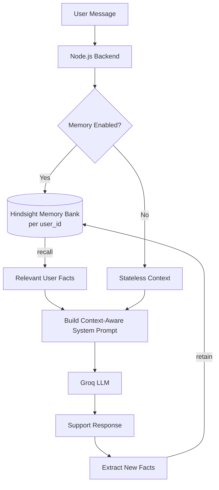

# identity-centric-support-agent
Identity-centric AI support agent with persistent memory. Recalls each customer's device, past issues, and attempted fixes via Hindsight, then generates context-aware replies with Groq, so customers never repeat themselves.

<h1 align="center">🧠 Identity-Centric Support Agent</h1>

<p align="center">
  <strong>Zero-repetition customer support powered by persistent, identity-linked memory.</strong>
</p>

<p align="center">
  An AI support agent that remembers every customer, understands their history, and never makes them explain the same problem twice, built with <strong>Hindsight</strong> memory and <strong>Groq</strong> inference.
</p>

<p align="center">
  
  
  
  
  
</p>

<p align="center">
  <a href="#-quick-start">Quick Start</a> •
  <a href="#-demo">Demo</a> •
  <a href="#-architecture">Architecture</a> •
  <a href="#-api-reference">API</a> •
  <a href="#-roadmap">Roadmap</a>
</p>

<!-- Replace with a real GIF or screenshot of your demo. This is the single highest-impact addition. -->
<p align="center">
  
</p>

---

## 📖 Table of Contents

- [The Problem](#-the-problem)
- [The Solution](#-the-solution)
- [Demo](#-demo)
- [Key Features](#-key-features)
- [Architecture](#-architecture)
- [How It Works](#-how-it-works)
- [Tech Stack](#-tech-stack)
- [Project Structure](#-project-structure)
- [Quick Start](#-quick-start)
- [Configuration](#-configuration)
- [API Reference](#-api-reference)
- [Memory Design](#-memory-design)
- [Privacy & Safety](#-privacy--safety)
- [Why This Matters](#-why-this-matters)
- [Roadmap](#-roadmap)
- [Contributing](#-contributing)
- [License](#-license)

---

## ❗ The Problem

Most AI support agents are **stateless**. A customer explains their device, account, error codes, and everything they've already tried, and when they come back the next day, they have to explain it all over again.

```text
Customer  →  "I already explained this last time."
Agent     →  "Can you describe the problem again?"
Customer  →  *repeats everything*
Result    →  Longer resolution time, frustrated customer, higher support cost
```

## ✅ The Solution

**One user → One persistent memory identity → Continuous support context.**

Every customer is tied to a stable `user_id`, which maps to a dedicated **Hindsight memory bank**. Before the LLM answers, the agent *recalls* what it already knows about that customer. After the conversation, it *extracts and retains* new facts for next time.

```text
Customer → Identity → Recall Memory → Inject Context → Groq LLM
                                                           ↓
              Future Conversations ← Retain Facts ← Extract Facts
```

The agent stops being a chatbot that resets every session and becomes a support agent that **learns the customer over time**.

---

## 🎬 Demo

The clearest way to see the value is to compare both modes side by side.

**Conversation 1: first contact**

> **User:** My MacBook Pro shows a 404 error when I try to log in. I already tried resetting my password.
>
> **Agent:** Sorry about that. Let's troubleshoot the 404 on login...

Facts extracted and retained:

```text
OS: macOS
Device: MacBook Pro
Issue: Login error (404)
Attempted: Password reset → failed
Status: Unresolved
```

**Conversation 2: the customer returns later**

> **User:** The problem is still happening.

| Mode | Agent response |
| --- | --- |
| ❌ **Stateless** | *"Can you tell me what problem you're experiencing?"* |
| ✅ **Identity-centric memory** | *"I remember the 404 login error on your MacBook Pro, and that the password reset didn't fix it. Let's move to the next step: clearing your cached credentials."* |

> The difference isn't a cleverer prompt. It's **persistent, identity-linked state**.

---

## ✨ Key Features

| Feature | Description |
| --- | --- |
| 🪪 **Identity-centric memory** | One memory bank per user, keyed by a stable `user_id`. |
| 🔁 **Read → Reason → Write loop** | Recall before responding, extract and retain after. |
| ⚡ **Fast inference** | Groq keeps responses low-latency, even with injected context. |
| 🧩 **Fact-based memory** | Stores concise, structured facts instead of raw transcripts. |
| 🔀 **A/B memory toggle** | Run the same conversation with memory ON or OFF to prove the impact. |
| 🧱 **Modular design** | Memory, LLM, and business logic are cleanly separated. |
| 🔒 **Per-user isolation** | No cross-customer memory leakage by design. |

---

## 🏗 Architecture

The system follows a continuous **Read → Reason → Write** loop.



---

## ⚙️ How It Works

### 1. Identity Resolution
Each request carries a stable identifier that determines which memory bank to use.

```javascript
const userId = "user_sarah_123";
const bankId = `user_${userId}`;
```

### 2. Memory Recall
Before generating a reply, the backend queries Hindsight for facts relevant to the current message.

```javascript
const memories = await hindsight.recall(bankId, currentUserMessage);
```

### 3. Context Injection
Recalled facts are placed into the system prompt.

```text
You are a customer support agent.

Relevant customer history:
- OS: macOS
- Device: MacBook Pro
- Previous issue: Login error (404)
- Password reset attempted: Yes → failed

Use this information when relevant.
Do not ask the customer to repeat information already known.
```

### 4. Response Generation
Groq generates the answer from **current message + persistent memory**. Memory management and inference stay decoupled.

### 5. Fact Extraction
After the conversation, a lightweight LLM pass converts the transcript into concise, durable facts.

```javascript
const newFacts = await extractFactsFromTranscript(chatLog);
// ["Customer uses macOS", "Password reset failed", "Login issue unresolved"]
```

### 6. Memory Write-Back
Extracted facts are persisted to the user's bank, ready for the next conversation.

```javascript
await hindsight.retain(bankId, newFacts);
```

---

## 🧰 Tech Stack

| Layer | Technology | Purpose |
| --- | --- | --- |
| Runtime | Node.js 18+ | Application runtime |
| Backend | Express (REST) | API and orchestration |
| Memory | [Hindsight](https://hindsight.vectorize.io) | Persistent, per-user memory |
| Inference | [Groq](https://groq.com) | Fast LLM responses |
| Config | `dotenv` | Secure API-key management |

---

## 📁 Project Structure

```text
identity-centric-support/
├── src/
│   ├── memory/
│   │   └── hindsight.js        # recall() / retain() wrappers
│   ├── llm/
│   │   ├── groq.js             # Groq chat completion client
│   │   └── factExtractor.js    # Transcript → structured facts
│   ├── routes/
│   │   └── support.js          # REST endpoints
│   ├── services/
│   │   └── supportAgent.js     # Read → Reason → Write orchestration
│   └── server.js               # App entry point
├── docs/
│   └── demo.gif                # Demo recording
├── .env.example
├── .gitignore
├── package.json
└── README.md
```

---

## 🚀 Quick Start

### Prerequisites

- Node.js **18+** and npm
- A [Hindsight](https://hindsight.vectorize.io) API key
- A [Groq](https://console.groq.com) API key

### 1. Clone

```bash
git clone https://github.com/yourusername/identity-centric-support.git
cd identity-centric-support
```

### 2. Install

```bash
npm install
```

### 3. Configure

```bash
cp .env.example .env
```

Then fill in your keys:

```env
HINDSIGHT_API_KEY=your_hindsight_api_key
GROQ_API_KEY=your_groq_api_key
MEMORY_MODE=on
PORT=3000
```

> ⚠️ Never commit `.env`. It is already listed in `.gitignore`.

### 4. Run

```bash
npm start
```

### Compare both modes

```bash
# Stateless baseline
MEMORY_MODE=off npm start

# Identity-centric memory
MEMORY_MODE=on npm start
```

---

## 🔧 Configuration

| Variable | Required | Default | Description |
| --- | :---: | --- | --- |
| `HINDSIGHT_API_KEY` | ✅ | n/a | Hindsight authentication key |
| `GROQ_API_KEY` | ✅ | n/a | Groq authentication key |
| `MEMORY_MODE` | ❌ | `on` | `on` = persistent memory, `off` = stateless baseline |
| `PORT` | ❌ | `3000` | Server port |

---

## 📡 API Reference

> Adjust paths to match your implementation.

### `POST /api/support/chat`

Send a message and receive a context-aware reply.

```bash
curl -X POST http://localhost:3000/api/support/chat \
  -H "Content-Type: application/json" \
  -d '{
    "userId": "user_sarah_123",
    "message": "The problem is still happening."
  }'
```

```json
{
  "reply": "I remember the 404 login error on your MacBook Pro...",
  "memoryUsed": true,
  "recalledFacts": [
    "Customer uses macOS",
    "Login error 404",
    "Password reset failed"
  ]
}
```

### `POST /api/support/end`

End a session, which triggers fact extraction and memory write-back.

```bash
curl -X POST http://localhost:3000/api/support/end \
  -H "Content-Type: application/json" \
  -d '{ "userId": "user_sarah_123" }'
```

### `GET /api/support/memory/:userId`

Inspect what the agent currently remembers about a user (useful for demos and debugging).

---

## 🧬 Memory Design

The agent stores **facts, not transcripts**.

| ✅ Retained | ❌ Not retained |
| --- | --- |
| Device, OS, environment | Full raw conversation logs |
| Errors and error codes | Small talk and filler |
| Steps attempted and outcomes | Duplicate information |
| Resolved / unresolved status | Sensitive data (passwords, card numbers) |
| Stated preferences | Anything the user asks to forget |

**Why facts?** They are compact, cheap to inject into a prompt, easy to audit, and far less noisy than replaying old chats.

---

## 🔐 Privacy & Safety

- **Per-user isolation:** each `user_id` maps to its own memory bank, so there's no cross-customer recall.
- **Sensitive-data filtering:** the fact extractor is instructed to skip credentials, payment data, and other secrets.
- **Transparency:** the memory-inspection endpoint lets you see exactly what is stored.
- **Right to forget:** memory banks can be cleared per user on request.
- **Secrets management:** API keys live in environment variables only.

---

## 💡 Why This Matters

- **For customers:** no more repeating themselves; faster, more personal help.
- **For support teams:** shorter resolution times and fewer escalations caused by lost context.
- **For AI engineering:** a practical pattern for giving LLM applications real long-term memory without bloating context windows.

**What sets this apart:** memory isn't bolted on as an optional plugin. Hindsight sits at the center of the core application loop (`recall → respond → extract → retain`), and the A/B toggle makes its impact directly measurable.

---

## 🗺 Roadmap

- [x] Identity-centric memory banks
- [x] Recall → Respond → Retain loop
- [x] Memory ON/OFF comparison mode
- [ ] Web chat UI with live "memory panel"
- [ ] Resolution tracking and automatic status updates
- [ ] Multi-channel identity linking (email, chat, phone)
- [ ] Human-agent handoff with memory summary
- [ ] Analytics: repeat-question rate and time-to-resolution
- [ ] Docker and one-click deploy

---

## 🤝 Contributing

Contributions are welcome!

1. Fork the repository
2. Create a branch: `git checkout -b feature/your-feature`
3. Commit your changes: `git commit -m "Add your feature"`
4. Push: `git push origin feature/your-feature`
5. Open a Pull Request

---

## 📄 License

Distributed under the **MIT License**. See [`LICENSE`](LICENSE) for details.

---

<p align="center">
  <strong>Customers should never have to repeat themselves.</strong><br>
  Built with ❤️ using Hindsight and Groq.
</p>
